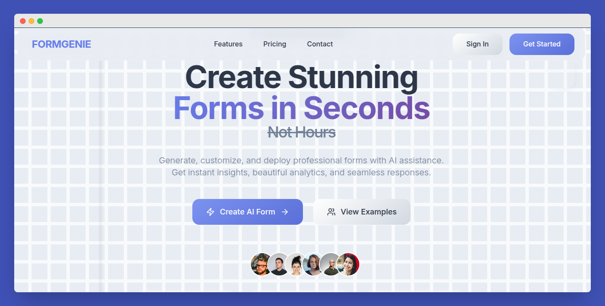
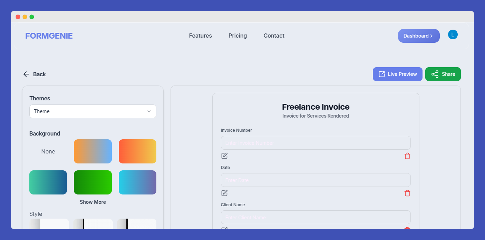
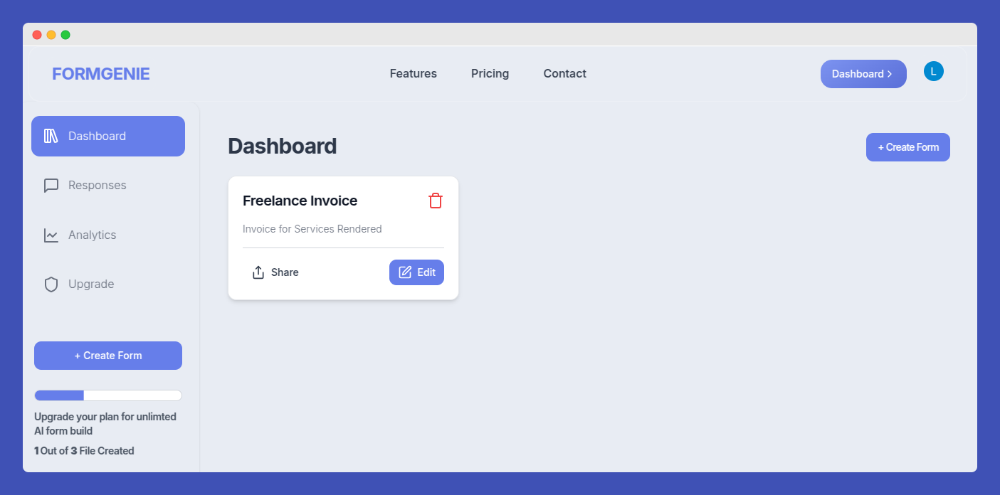

# FormGenie — AI-Powered Form Builder

FormGenie is a smart, AI-driven form builder that helps you create fully customized forms instantly without writing a single line of code. Simply describe your form, and let the AI generate the JSON schema and form structure for you. Perfect for surveys, registrations, feedback, and more.

---

## Features

- **AI-Driven Form Creation**  
  Describe your form and watch FormGenie generate complex JSON forms automatically.

- **User-Friendly Interface**  
  Simple, clean UI with drag-and-drop and easy customization.

- **Form Management Dashboard**  
  View, edit, and manage all your forms in one place.

- **Smart Validation & Logic**  
  Supports required fields, checkbox and select options, and conditional logic.

- **Fast Deployment**  
  Create and launch forms instantly with zero hassle.

---

## Screenshots

### Landing Page  
  
Clean and inviting landing page for easy access and user onboarding.

### Form Creation  
  
Describe your form and let the AI build the form schema automatically.

### Dashboard  
  
Manage all your forms, track submissions, and edit existing forms effortlessly.

---

## Getting Started

### Prerequisites

- Node.js (v16+ recommended)
- Yarn or npm
- PostgreSQL (or your preferred supported database)
- Clerk account for authentication

### Installation

1. Clone the repository:

```bash
git clone https://github.com/yourusername/formgenie.git
cd formgenie
